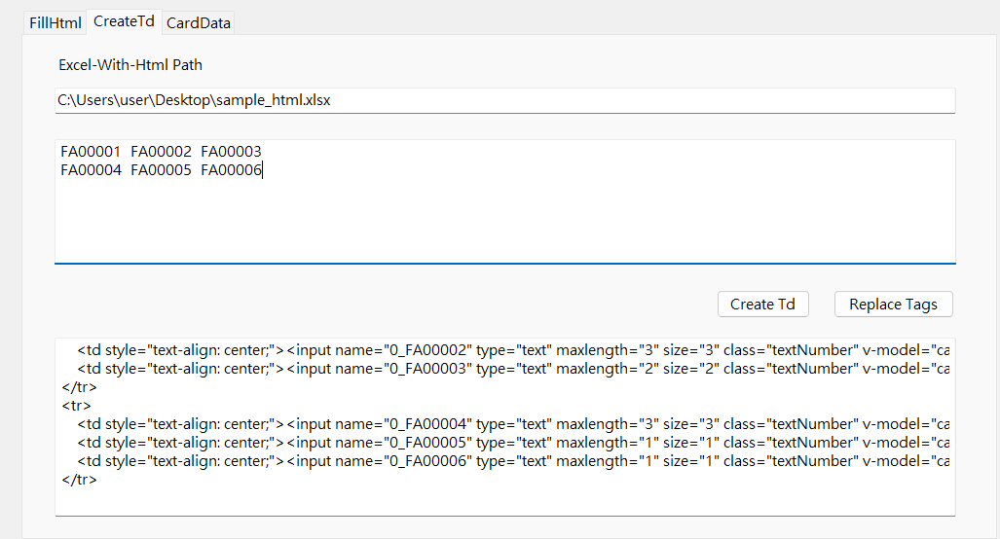

# ReportDevHelper

- features
    - FillHtml
    - CreateTd
    - ReplaceTags
    - GenProps
    - cardData.js

## FillHtml
- 輸入 Type、RadioValues 產生欄位 Html


## Create Td
- 欄位產生 Table Html



### input
```
FA00001	FA00002	FA00003
FA00004	FA00005	FA00006
```

### output
```
<tr>
    <td style="text-align: center;"><input name="0_FA00001" type="text" maxlength="4" size="4" class="textNumber" v-model="cardData[0].FA00001.FormValue" :data-value="cardData[0].FA00001.PreviousData" :disabled="!unlockAllColumn &amp;&amp; !cardData[0].FA00001.IsManual &amp;&amp; cardData[0].FA00001.DataErrorListColumnId==-1" :haserror="cardData[0].FA00001.DataErrorListColumnId" /></td>
    <td style="text-align: center;"><input name="0_FA00002" type="text" maxlength="3" size="3" class="textNumber" v-model="cardData[0].FA00002.FormValue" :data-value="cardData[0].FA00002.PreviousData" :disabled="!unlockAllColumn &amp;&amp; !cardData[0].FA00002.IsManual &amp;&amp; cardData[0].FA00002.DataErrorListColumnId==-1" :haserror="cardData[0].FA00002.DataErrorListColumnId" /></td>
    <td style="text-align: center;"><input name="0_FA00003" type="text" maxlength="2" size="2" class="textNumber" v-model="cardData[0].FA00003.FormValue" :data-value="cardData[0].FA00003.PreviousData" :disabled="!unlockAllColumn &amp;&amp; !cardData[0].FA00003.IsManual &amp;&amp; cardData[0].FA00003.DataErrorListColumnId==-1" :haserror="cardData[0].FA00003.DataErrorListColumnId" /></td>
</tr>
<tr>
    <td style="text-align: center;"><input name="0_FA00004" type="text" maxlength="3" size="3" class="textNumber" v-model="cardData[0].FA00004.FormValue" :data-value="cardData[0].FA00004.PreviousData" :disabled="!unlockAllColumn &amp;&amp; !cardData[0].FA00004.IsManual &amp;&amp; cardData[0].FA00004.DataErrorListColumnId==-1" :haserror="cardData[0].FA00004.DataErrorListColumnId" /></td>
    <td style="text-align: center;"><input name="0_FA00005" type="text" maxlength="1" size="1" class="textNumber" v-model="cardData[0].FA00005.FormValue" :data-value="cardData[0].FA00005.PreviousData" :disabled="!unlockAllColumn &amp;&amp; !cardData[0].FA00005.IsManual &amp;&amp; cardData[0].FA00005.DataErrorListColumnId==-1" :haserror="cardData[0].FA00005.DataErrorListColumnId" /></td>
    <td style="text-align: center;"><input name="0_FA00006" type="text" maxlength="1" size="1" class="textNumber" v-model="cardData[0].FA00006.FormValue" :data-value="cardData[0].FA00006.PreviousData" :disabled="!unlockAllColumn &amp;&amp; !cardData[0].FA00006.IsManual &amp;&amp; cardData[0].FA00006.DataErrorListColumnId==-1" :haserror="cardData[0].FA00006.DataErrorListColumnId" /></td>
</tr>
```

## Replace Tags
- 取代標籤為 Html


### input
```
<ul>
    <li>[FB30002@1] option1</li>
    <li>[FB30002@2] option2</li>
    <li>[FB30002@3] option3</li>
</ul>
<label>foobar:</label>[FB51002]
```

### output
```
<ul>
    <li><input name="0_FB30002" type="radio" value="1" id="FB30002_1" v-on:click="unLockFollowColumn($event)" class="textNumber" v-model="cardData[0].FB30002.FormValue" :data-value="cardData[0].FB30002.PreviousData" :disabled="!unlockAllColumn &amp;&amp; !cardData[0].FB30002.IsManual &amp;&amp; cardData[0].FB30002.DataErrorListColumnId==-1" :haserror="cardData[0].FB30002.DataErrorListColumnId" /> option1</li>
    <li><input name="0_FB30002" type="radio" value="2" id="FB30002_2" v-on:click="unLockFollowColumn($event)" class="textNumber" v-model="cardData[0].FB30002.FormValue" :data-value="cardData[0].FB30002.PreviousData" :disabled="!unlockAllColumn &amp;&amp; !cardData[0].FB30002.IsManual &amp;&amp; cardData[0].FB30002.DataErrorListColumnId==-1" :haserror="cardData[0].FB30002.DataErrorListColumnId" /> option2</li>
    <li><input name="0_FB30002" type="radio" value="3" id="FB30002_3" v-on:click="unLockFollowColumn($event)" class="textNumber" v-model="cardData[0].FB30002.FormValue" :data-value="cardData[0].FB30002.PreviousData" :disabled="!unlockAllColumn &amp;&amp; !cardData[0].FB30002.IsManual &amp;&amp; cardData[0].FB30002.DataErrorListColumnId==-1" :haserror="cardData[0].FB30002.DataErrorListColumnId" /> option3</li>
</ul>
<label>foobar:</label><input name="0_FB51002" type="text" maxlength="5" size="5" style="text-align: right;" class="textNumber" v-model="cardData[0].FB51002.FormValue" :data-value="cardData[0].FB51002.PreviousData" :disabled="!unlockAllColumn &amp;&amp; !cardData[0].FB51002.IsManual &amp;&amp; cardData[0].FB51002.DataErrorListColumnId==-1" :haserror="cardData[0].FB51002.DataErrorListColumnId" />
```

## Gen Props
- generate matched props


### input
```
FB25**1 + FB27**1
```

### output
```
FB25011 + FB27011
FB25021 + FB27021
FB25031 + FB27031
FB25041 + FB27041
FB25051 + FB27051
```

## CardData
- 輸入 Sql 產生 cardData Javascript 物件語法
